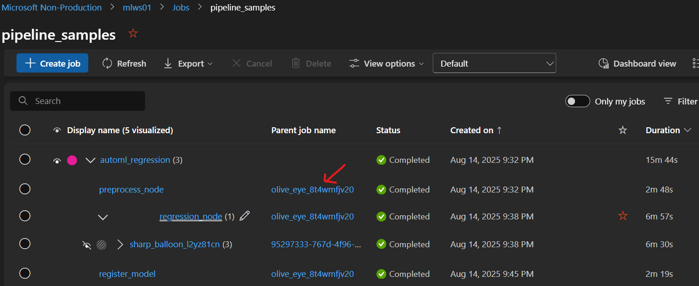
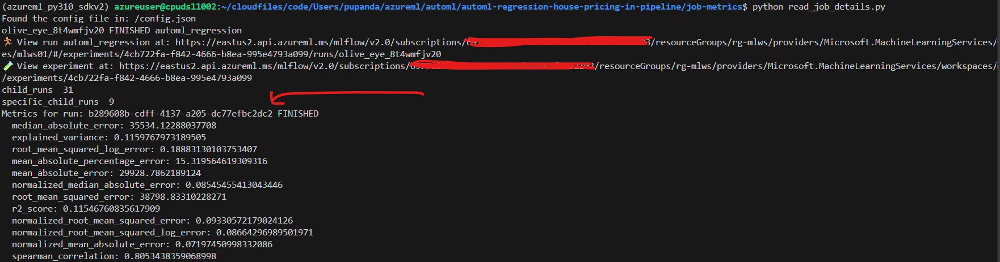
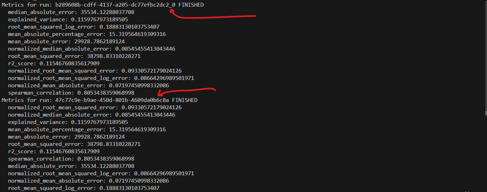

## Topics covered
- [Find the job id from ML Studio](#find-the-job-id-from-ml-studio)
- [Run the script to load child job metrics](#run-the-script-to-load-child-job-metrics)
- [Read job details in AzureML workspace scope](#read-job-details-in-azureml-workspace-scope)
- [Read job details with model association](#read-job-details-with-model-association)


## Find the job id from ml studio


Replace the `root job id` in script placeholder. Root job id is not mandatory, but would be nice if root is picked.

```python
# Root job run id
root_run_id = "" # Place the actual job run id e.g. olive_eye_8t4wmfjv20

# Read ml job details
run = ml_client.jobs.get(name=root_run_id)

# Access the current job run details
with mlflow.start_run(run_id=root_run_id) as run:
    _run = mlflow.get_run(run.info.run_id)
    print(_run.info.run_id, _run.info.status, _run.info.run_name)
    experiment_id = _run.info.experiment_id
```

## Run the script to load child job metrics

```
conda activate azureml_py310_sdkv2
pip install -U azure-ai-ml
pip install -U azureml-mlflow
cd job-metrics
python read_job_details.py
```



## Read job details in azureml workspace scope
- Natively azureml leverages mlflow for tracking purpose, as mlflow server side is already built on the azureml platform end.
- Think of `job` in azureml as the schematic definition with data file, dependencies, scripts, which is used to submit runs on azureml platform.
- Think of `run` in azureml as the actual run instance or runtime outcome of the job submitted.
- This `run` detail can easily be tracked using mlflow.
- Though v1 and v2 kind of job schema came in azureml, the `run` infrastructure on azureml side for job is still the same. So, mlflow will help track both.

```
# Lists all experiments visible in the current tracking URI
## Search for experiments with no filter
experiments = mlflow.search_experiments()   # returns List[Experiment]

# Print all experiments and their child runs
for e in experiments:
    print(f"name={e.name}\tid={e.experiment_id}\tlifecycle={e.lifecycle_stage}")

    # Search for child runs on the experiment_id basis
    child_runs = mlflow.search_runs(
        experiment_ids=[e.experiment_id],
        output_format="list",
    )
    print("len(child_runs): ", len(child_runs))

    for run in child_runs:
        print(f"\trun_id={run.info.run_id}\tstatus={run.info.status}")

        # # Uncomment below to debug specific run - just in case more verbose info needed
        # print("run\t", run)

```

- **How to run it?**
```
python read_all_jobs.py
```

## Read job details with model association
In order to validate if ml model association with job runs, few of the activities to think like:
- Case 1: Using fsspec, check the run artifact storage for model files.
- Case 2: Using models.list(), check models for job_name (or run_id) association. Model will be associated with artifact storage of the run.
- In either case, artifact storage validation for the run is needed.

```
def _run_has_model(run_id: str) -> bool:
    """Check if the given run has model association by checking its artifact storage."""
    ..
    ..
    
    # Instatiate the filesystem using uri
    fs = AzureMachineLearningFileSystem(uri = uri_path)

    # glob for recursive listing
    paths = fs.glob("**/*model*")

    # Check if any model related files/ folders found. Return its results.
    if paths:
        return True
    else:        
        return False
```

- **How to run it?**
```
pip install azureml-fsspec
python read_all_jobs_with_model.py
```

## Reference for mlflow search
[Manage runs with mlflow](https://learn.microsoft.com/en-us/azure/machine-learning/how-to-track-experiments-mlflow?view=azureml-api-2#query-and-search-experiments)

